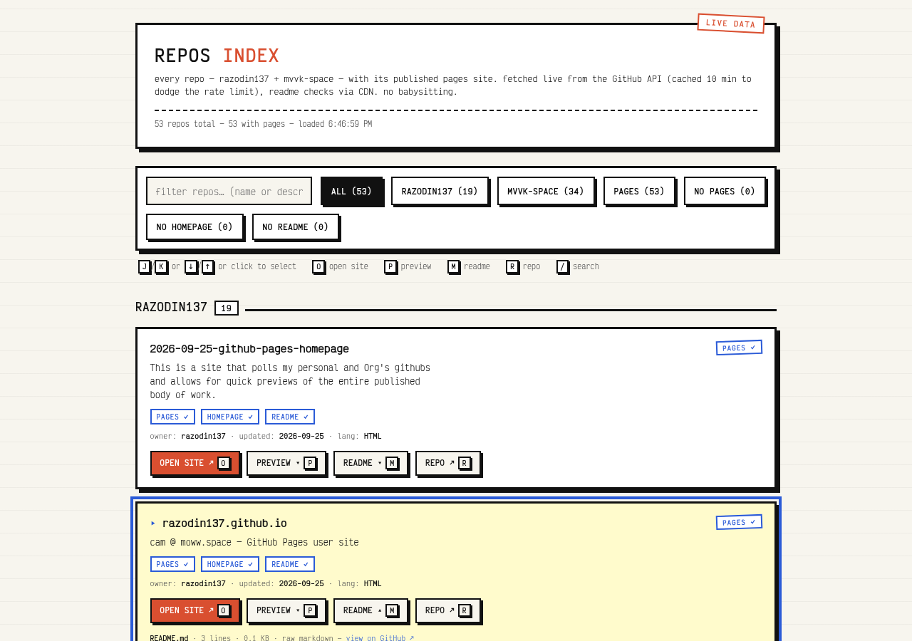

# repos-index

A single-file dashboard that lists every repo from [razodin137](https://github.com/razodin137) and the [mvvk-space](https://github.com/mvvk-space) org, each with one-click access to its published site, its GitHub repo, and an inline preview.

**Live at:** <https://razodin137.github.io/2026-09-25-github-pages-homepage/>



## Why

GitHub's repo list is a mess to click through. This gives a fast triage flow instead:

1. Scan the list — each card shows the repo name, description, language, and last-push date.
2. **"What's this about?"** — the description is right there.
3. **"Is it published?"** — if a site exists, OPEN SITE / PREVIEW buttons appear.
4. Move on, in seconds.

## Features

- **Shows every repo, published or not** — it doubles as a checklist for projects that come in without their boxes checked.
- **Per-repo checklist badges**:
  - `PAGES ✓` / `NO PAGES ✗` — is GitHub Pages enabled?
  - `HOMEPAGE ✓` / `NO HOMEPAGE ✗` — is the homepage field set on the repo?
  - `README ✓` / `NO README ✗` — does the repo have a README? (checked via jsDelivr's data API, with a raw.githubusercontent.com fallback for repos jsDelivr can't enumerate — cached in localStorage for 7 days; first visit shows `README…` and fills in within a few seconds)
- **Read the README inline** — every repo with a README gets a `README ▾` button (or press `M` with the card selected). The raw markdown drops straight into the card with a line/KB count, so you can eyeball README quality without leaving the page. No markdown renderer, no dependencies — just the text.
- **Counts on the filter buttons** — `PAGES (53)` shows the *combined* total across both accounts at a glance, no mental math.
- **Newest projects first** — cards are ordered by repo creation date, so new work lands at the top.
- **Filters** — ALL / RAZODIN137 / MVVK-SPACE / PAGES / NO PAGES / NO HOMEPAGE / NO README. Use the "NO …" segments to see exactly what still needs publishing.
- **Live data, zero maintenance** — queries the GitHub REST API client-side on every page load (with a 10-minute local cache to dodge the rate limit). New repos and new pages sites appear automatically. No build step, no server, no cron, nothing to babysit.
- **Degrades instead of bricking** — if one owner's fetch fails (rate limit, API hiccup), the other owner still renders and the meta line says exactly what couldn't be fetched. If the API is fully rate-limited but a recent list is cached, the page renders from cache with a note.
- **Site links from the repo's own `homepage` field** — falls back to `https://<owner>.github.io/<repo>/` when a repo has Pages enabled but no homepage set.
- **Search** — live filter across names and descriptions.
- **Inline preview** — embeds the published site in an iframe without leaving the page.
- **Neobrutalist wireframe styling** — ink borders, hard shadows, Courier New, ruled-paper background.

## Keyboard shortcuts

| Key | Action |
| --- | --- |
| `J` / `K` or `↓` / `↑` | select next / previous repo |
| click | select any repo |
| `O` | open the selected repo's **site** in a new tab |
| `P` | toggle inline **preview** of the site |
| `M` | expand the selected repo's **README** |
| `R` | open the **repo** on GitHub |
| `/` | focus the search box (`Esc` / `Enter` to leave) |

## How it works

The whole thing is one static `index.html`. On load it fetches:

```
GET https://api.github.com/users/<owner>/repos?per_page=100
```

for each owner, then renders the cards. GitHub's API sends `access-control-allow-origin: *`, so direct browser calls work from any static host — no proxy needed.

**Rate-limit strategy (learned the hard way):**

- **Repo lists** come from `api.github.com` — 60 requests/hour unauthenticated, 2 used per visit. Three defenses keep you safe:
  - **ETag conditional requests** — on repeat visits, `If-None-Match` returns `304 Not Modified`, which *doesn't count* against the limit.
  - **…but only for 10 minutes** (`ETAG_TTL`). GitHub's list ETags do **not** change when you flip `has_pages` on a repo (enabling Pages doesn't touch `updated_at`), so an unconditional etag match would happily serve a stale cached list forever — the dashboard once swore only 19 repos had pages when the real combined total was 53. Past the TTL, the page refetches and pays 1 request per owner. Worst case with heavy reload-testing: ~12 requests/hour — still comfortably under the limit.
  - **localStorage fallback** — the last successful list is cached (versioned + shape-checked so stale cache formats can't be misread); if the limit is ever hit, the page renders from cache with a "showing cached list" note, and per-owner failures don't brick the page.
- **README checks and README contents never touch `api.github.com`** (one call per repo would exhaust the limit instantly). File listings come from [jsDelivr's data API](https://data.jsdelivr.com) — no rate limit, full CORS — and README content is fetched as raw markdown from `raw.githubusercontent.com` (also CDN-served, no API limit). Repos too big for jsDelivr to enumerate fall back to probing the raw endpoint directly. Results cached in localStorage for 7 days.
- **No token, no secret needed anywhere.** A personal access token in client-side code would be readable by anyone visiting the page, and GitHub auto-revokes tokens it finds in public files — so instead, everything per-repo runs through endpoints that don't count against the 60/hr API limit.

## Adding more owners

Edit the `OWNERS` array near the top of the script in `index.html`:

```js
const OWNERS = ["razodin137", "mvvk-space"];
```

Any user or org works — the API endpoint is the same.

## Embedding caveat

Some sites (GitHub itself, sites with `X-Frame-Options: DENY`, etc.) refuse to be iframed and will render blank in the preview. The OPEN SITE button always works.

## Deployment

Any static host works. This repo serves it via GitHub Pages from the `master` branch:

```
gh api -X POST repos/<you>/<repo>/pages -f "source[branch]=master" -f "source[path]=/"
gh api -X PATCH repos/<you>/<repo> -f homepage="https://<you>.github.io/<repo>/"
```

## License

No license — it's a personal utility. Do what you want.